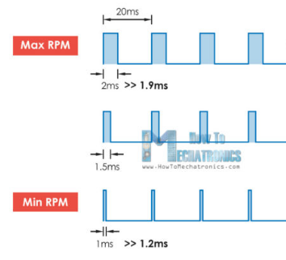
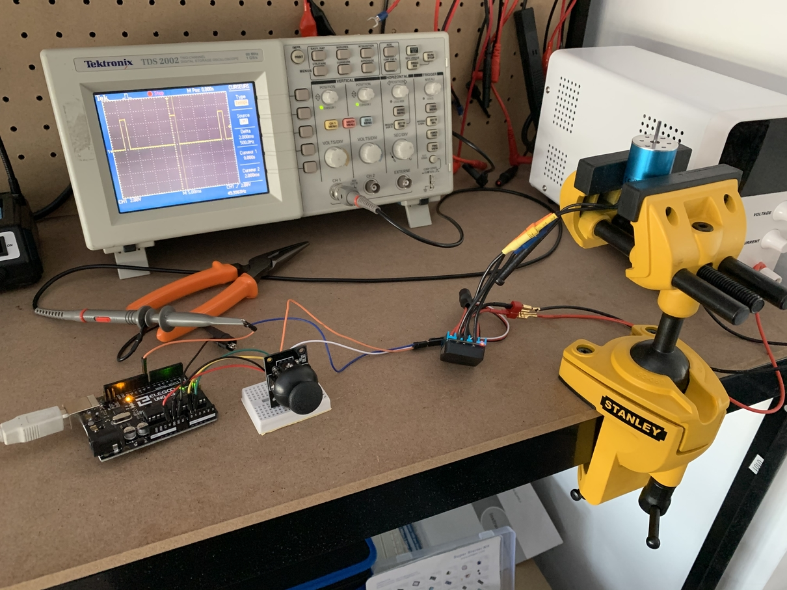

### Purpose

This is a script to command a brushless 7200kv motor via a ESC board. ESC boards are commonly used to control motors in plane models concept. 

### Test setup

In order to test that hardware, I have used an Arduino board and a joystick from which I'm using only the top vertical axis.

I used my lab generator with 10A max which is not great as this ESC is supposed to work up to 30A.

ESC is controlled using a square 50Hz signal, with TOP duration within 1 to 2ms.

This is the general setup:

### Demo

### Conclusion

We can see that this is working ok, even though there are a few issues which will stop me from continuing with the ESC control board:

- This is designed to be used with a stick, so it's full of calibration procedures to realize by pushing the stick in the proper direction at the right time, synchronizing with audio beeps... I don't intend to have a stick at the end, so I find that this is extra unnecessary overhead.

- The second thing I dislike is that the ESC is designed to be used with Li-Ion batteries. It automatically determines the number of cells and setup the appropriate security features (such as minimum voltage thresholds etc...) . So when setting up a generator, the voltage has to be within certain specific ranges to pretend that the system is running on a battery. At the end, I don't intend to use only batteries and I would like some more freedom in that area.

- But the most important reason for which I don't want to pursue in that direction is that the resolution and frequency of control is limited by design. It's limited because it's supposed to be used with a stick with a specific signal protocol. This signal is expected to be 50Hz, meaning that we can't send new command value faster than 20ms. This is much to high when you target a fast control loop at the end (~ 1ms ideally).  Then, the way this signal is specified, it needs to be top for 1 to 2ms (1ms -> 0 rpm target and 2ms is max speed). It means that we only use 10% of the full 20ms range for setting a target. Not very optimized regarding resolution.

  